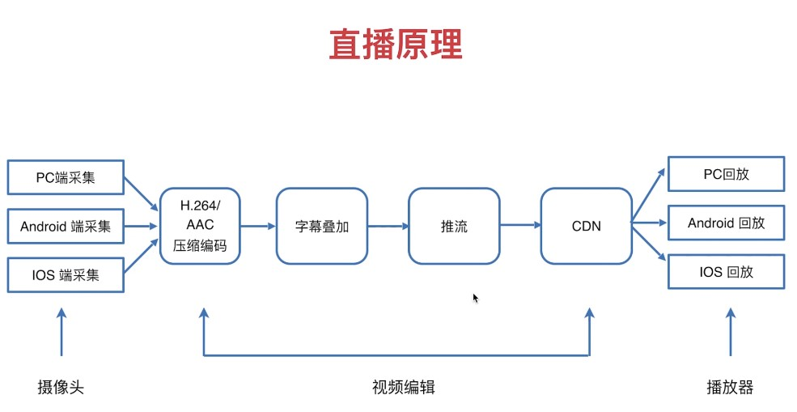
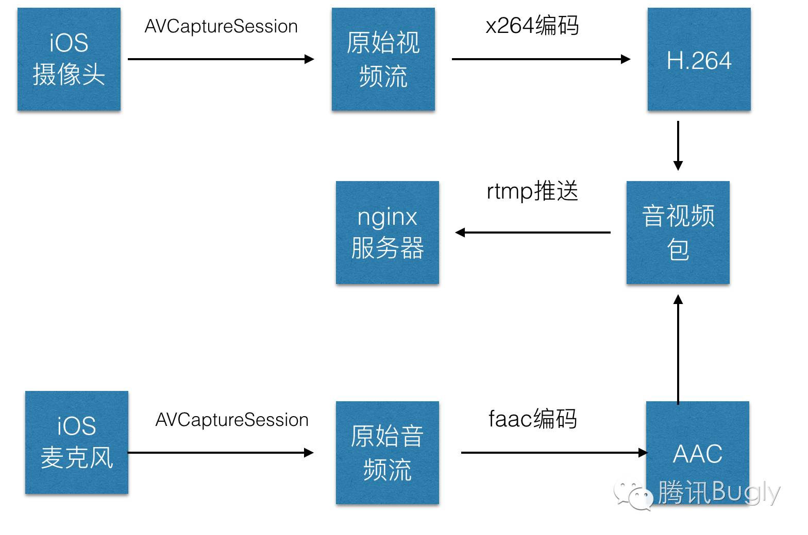
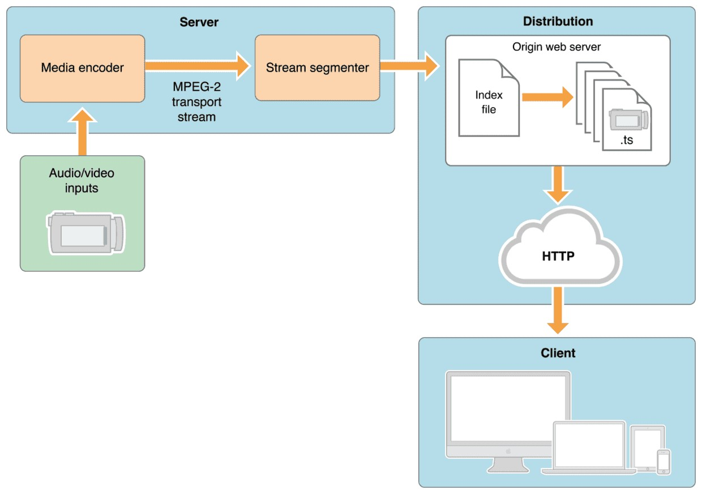
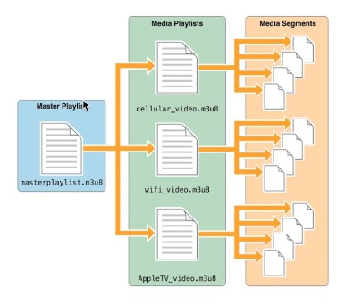
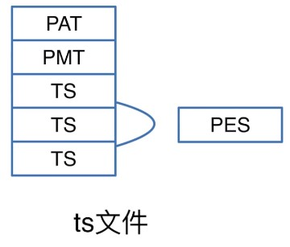

# h5微信小程序直播

## 大前端

- ES6 + Vue/React/Angular + Webpack + three.js + d3.js + raphael.js + echart.js + video.js + hls.js + flv.js + express + koa

## 技术架构

### 服务类

- Node
- Express
- Koa

### 3D图像

- three.js

### 二维图像

- d3.js
- raphael.js
- echart.js

### 视频

- video.js
- hls.js
- flv.js

## 直播公司

- 虎牙
- 花椒
- 直播网
- 央客网
- 斗鱼
- 全民直播
- 熊猫
- YY
- bilibili
- 火山

## 直播原理



- PC端：购买专业的麦克风，高清分辨率；已PC端为主采集
- Android/IOS: 分辨率比较低

- 压缩编码
  - 视频编码：H.264
  - 音频编码：AAC
- 字母叠加
  - 水印处理
- 推流
  - 推送到服务器上
- CDN
  - 服务器部署到CDN上
  - 用户可以直接访问


- 点播：视频网站
- 直播：在线播放视频

### 视频格式

- mp4： 支持播放在 Chrome,Firefox, Safari
  - 点播
- webm: 支持播放在 Chrome, Firefox
  - Youtube
  - 点播
- hls: 支持播放在 Safari, .ts格式，苹果研发的
  - 视频协议
  - 直播，点播
- flv
  - bilibili支持播放
  - 直播，点播

### 直播协议

#### HLS 协议(.ts)

> HTTP Live Streaming（缩写是HLS）是一个由苹果公司提出的基于HTTP的流媒体网络传输协议。是苹果公司QuickTime X和iPhone软件系统的一部分。


它的工作原理是把整个流分成一个个小的基于HTTP的文件来下载，每次只下载一些。用于 H5 播放直播视频时引入的一个 .m3u8 的文件，这个文件就是基于 HLS 协议，存放**视频流元数据**的文件。

每一个 .m3u8 文件，分别对应若干个 ts 文件，这些 ts 文件才是真正存放视频的数据，m3u8 文件只是存放了一些 ts 文件的配置信息和相关路径，当视频播放时，.m3u8 是动态改变的，video 标签会解析这个文件，并找到对应的 ts 文件来播放，所以一般为了加快速度，.m3u8 放在 web 服务器上，ts 文件放在 cdn 上。

.m3u8 文件，其实就是以 UTF-8 编码的 m3u 文件，这个文件本身不能播放，只是存放了播放信息的文本文件：

``` m3u8
#EXTM3U                 m3u文件头
#EXT-X-MEDIA-SEQUENCE   第一个TS分片的序列号
#EXT-X-TARGETDURATION   每个分片TS的最大的时长
#EXT-X-ALLOW-CACHE      是否允许cache
#EXT-X-ENDLIST          m3u8文件结束符
#EXTINF                 指定每个媒体段(ts)的持续时间（秒），仅对其后面的URI有效
mystream-12.ts
```

当媒体流正在播放时，客户端可以选择从许多不同的备用源中以不同的速率下载同样的资源，允许流媒体会话适应不同的数据速率。

在开始一个流媒体会话时，客户端会下载一个包含元数据的extended M3U (m3u8)playlist文件，用于寻找可用的媒体流。

HLS只请求基本的HTTP报文，与实时传输协议（RTP)不同，HLS可以穿过任何允许HTTP数据通过的防火墙或者代理服务器。

​它也很容易使用内容分发网络来传输媒体流。

但HLS也有一些无法跨越的坑，比如采用HLS协议直播的视频延迟时间无法下到10秒以下，而RTMP协议的延迟最低可以到1秒左右。
​所以说对直播延迟比较敏感的服务请慎用HLS

- HLS 的请求流程是：

1. http 请求 m3u8 的 url
2. 服务端返回一个 m3u8 的播放列表，这个播放列表是实时更新的，一般一次给出5段数据的 url
3. 客户端解析 m3u8 的播放列表，再按序请求每一段的 url，获取 ts 数据流

- HLS 直播延时
我们知道 hls 协议是将直播流分成一段一段的小段视频去下载播放的，所以假设列表里面的包含5个 ts 文件，每个 TS 文件包含5秒的视频内容，那么整体的延迟就是25秒。因为当你看到这些视频时，主播已经将视频录制好上传上去了，所以时这样产生的延迟。当然可以缩短列表的长度和单个 ts 文件的大小来降低延迟，极致来说可以缩减列表长度为1，并且 ts 的时长为1s，但是这样会造成请求次数增加，增大服务器压力，当网速慢时回造成更多的缓冲，所以苹果官方推荐的ts时长时10s，所以这样就会大改有30s的延迟。

视频直播的整个流程是什么？

当视频直播可大致分为：

1. 视频录制端：一般是电脑上的音视频输入设备或者手机端的摄像头或者麦克风，目前以移动端的手机视频为主。

2. 视频播放端：可以是电脑上的播放器，手机端的 native 播放器，还有就是 h5 的 video 标签等，目前还是已手机端的 native 播放器为主。

3. 视频服务器端：一般是一台 nginx 服务器，用来接受视频录制端提供的视频源，同时提供给视频播放端流服务。


怎样进行音视频采集？

视频编码：所谓视频编码就是指通过特定的压缩技术，将某个视频格式的文件转换成另一种视频格式文件的方式，我们使用的 iphone 录制的视频，必须要经过编码，上传，解码，才能真正的在用户端的播放器里播放。

编解码标准：视频流传输中最为重要的编解码标准有国际电联的H.261、H.263、H.264，其中 HLS 协议支持 H.264 格式的编码。

音频编码：同视频编码类似，将原始的音频流按照一定的标准进行编码，上传，解码，同时在播放器里播放，当然音频也有许多编码标准，例如 PCM 编码，WMA 编码，AAC 编码等等，这里我们 HLS 协议支持的音频编码方式是AAC编码。

下面将利用 ios 上的摄像头，进行音视频的数据采集，主要分为以下几个步骤：

1. 音视频的采集，ios 中，利用 AVCaptureSession和AVCaptureDevice 可以采集到原始的音视频数据流。

2. 对视频进行 H264 编码，对音频进行 AAC 编码，在 ios 中分别有已经封装好的编码库来实现对音视频的编码。

3. 对编码后的音、视频数据进行组装封包；

4. 建立 RTMP 连接并上推到服务端。



x264编码：https://github.com/kewlbear/x264-ios

faac编码：https://github.com/fflydev/faac-ios-build

ffmpeg编码：https://github.com/kewlbear/FFmpeg-iOS-build-script

关于如果想给视频增加一些特殊效果，例如增加滤镜等，一般在编码前给使用滤镜库，但是这样也会造成一些耗时，导致上传视频数据有一定延时。



2.1 三个大部分的解析

1. Server :
服务器组件负责获取的媒体输入流 , 然后Media编码后 MPEG-4（H.264 video 和 AAC audio）格式
​然后用硬件打包到 MPEG-2 (MPEG-2 transport stream)的传输流中。
​图中显示,传输流会经过stream segmenter, 这里的工作是MPEG-2传输流会被分散为小片段然后保存为一个或多个系列的 .ts 格式的媒体文件。
​这个过程需要借助编码工具来完成，比如 Apple stream segmenter。
(视频类是.ts文件,纯音频会被编码为一些音频小片段，通常为 ADTS头的AAC、MP3、或者 AC-3格式。)
服务端可以采用硬件编码和软件编码两种形式，其功能都是按照上文描述的规则对现有的媒体文件进行切片并使用索引文件进行管理。
​而软件切片通常会使用 Apple 公司提供的工具或者第三方的集成工具。

2. Distribution :
同时上面提到的那个切片器（segmenter）也会创建一个索引文件，通常会包含这些媒体文件的一个列表，也能包含元数据。
​他一般都是一个.M3U8的列表。列表元素会关联一个 URL 用于客户端访问。然后按序去请求这些 URL。

 3. client :
分配组件由标准的网络服务器。他们负责接受Client客户端请求并提供相关联的资源给客户端。

 
上面的图的每一块解释

1.Media encoder (媒体编码) :
媒体编码器获取到音视频设备的实时信号，将其编码后压缩用于传输。
​而编码格式必须配置为客户端所支持的格式，比如 H.264 视频和HE-AAC 音频。
​当前，支持 用于视频的 MPEG-2 传输流和 纯音频 MPEG 基本流。
​编码器通过本地网络将 MPEG-2 传输流分发出去，送到流切片器(Stream segmenter)那里。
​标准传输流和压缩传输流无法混合使用。传输流(这个流是指, 图中MPEG-2 transport stream流)可以被打包成很多种不同的压缩格式，
​这里有两个表详细列举了支持的压缩格式类型。

音频框架技术: Audio Technologies 
视频框架 : Vedio Technologies

在编码中途，不要修改视频编码器的设置，比如视频大小或者编码解码器类型。

如果避免不了，那修改动作必须发生在一个片段边界。并且需要早之后相连的片段上用 EXT-X-DISCONTINUITY进行标记。

2.Stream segmenter (流切片器)
流切片器（通常是一个软件,一个SDK）会通过本地网络从上面的媒体编码器中读取数据，
​然后将着这些数据一组相等时间间隔的小媒体文件。虽然每一个片段都是一个单独的文件，
​但是他们的来源是一个连续的流，切完照样可以无缝重构回去。
切片器在切片同时会创建一个索引文件(Index file)，索引文件会包含这些切片文件的引用。
​每当一个切片文件生成后，索引文件都会进行更新。索引用于追踪切片文件的有效性和定位切片文件的位置。
​切片器同时也可以对你的媒体片段进行加密并且创建一个密钥文件作为整个过程的一部分。

 3.文件切片器（相对于上面的流切片器, 就是切文件的）

如果已经有编码后的文件（而不是编码流），你可以使用文件切片器，
​通过它对编码后的媒体文件进行 MPEG-2 流的封装并且将它们分割为等长度的小片段。
​切片器允许你使用已经存在的音视频库用于 HLS 服务。
​它和流切片器的功能相似，但是处理的源从流替换流为了文件。

4. 媒体片段文件,(上面切除来的小片段)

媒体片段是由切片器生成的，基于编码后的媒体源，并且是由一系列的 .ts(如果是纯音频则不是.ts格式)格式的文件组成，
​其中包含了你想通过 MPEG-2 传送流携带的 H.264 视频 和 AAC /MP3/AC-3 音频。
​对于纯音频的广播，切片器可以生产 MPEG 基础音频流，其中包含了 ADTS头的AAC、MP3、或者AC3等音频。

5. 索引文件（PlayLists）

通常由切片器附带生成，保存为 .m3u8格式，.m3u一般用于 MP3 音频的索引文件。

Note如果你的扩展名是.m3u,并且系统支持.mp3文件，
​那客户的软件可能要与典型的 MP3 playList 保持一致来完成 流网络音频的播放。
​
4. .m3u8 PlayLists文件

为了更精确，你可以在 version 3 或者之后的协议版本中使用 float 数来标记媒体片段的时长，
​并且要明确写明版本号，如果没有版本号，则必须与 version 1 协议保持一致。
​你可以使用官方提供的切片器去生产各种各样的 playlist 索引文件，详见 媒体文件切片器

5. Distribution分布式部署
分布式系统是一个网络服务或者一个网络缓存系统，用于通过 HTTP 向客户端发送媒体文件和索引文件。
​不用自定义模块发送内容。通常仅仅需要很简单的网络配置即可使用。
​而且这种配置一般就是限制指定 .M38U 文件和 .ts 文件的 MIME 类型。详见 部署 HTTP Live Streaming

6. Client客户端部分
客户端开始时回去抓取 索引文件(.m3u8/.m3u)，其中用URL来标记不同的流。
​索引文件可以指定可用媒体文件的位置，解密的密钥，以及任何可以切换的流。
​对于选中的流，客户端会有序的下载每一个可获得的文件。
​每一个文件都包含流中的连环碎片。一旦下载到足够量的数据，客户端会开始向用户展示重新装配好的媒体资源。
客户端负责抓取任何解密密钥，认证或者展示一个用于认证的界面，之后再解密需要的文件。
这个过程会一直持续知道出现 结束标记 #EXT-X-ENDLIST
。如果结束标记不出现，该索引就是用于持续广播的。客户端会定期的加载一些新的索引文件。
​客户端会从新更新的索引文件中去查找加密密钥并且将关联的URL加入到请求队列中去。


- M3U8 是索引会有几个片段
- Safari 浏览器识别 M3U8文件
- M3U8文件segemnt-n.ts是每个直播流的片段
- M3U8 更新问题
  - 向服务器请求新的M3U8文件

1. 安装 Safari 浏览器
2. 用 Safari 浏览器打开下面任意地址均可

- http://live.streamingfast.net/osmflivech4.m3u8
- http://live.streamingfast.net/osmflivech5.m3u8
- http://live.streamingfast.net/osmflivech1.m3u8

- 

- 动态列表(live playlist)
- 全量列表(live playlist)
  - 点播
- 静态列表(event playlist)

- m3u8文件

``` 动态列表
#EXTM3U
#EXT-X-VERSION:6 版本声明
#EXT-X-TARGETDURATION:10 默认视频时长
#EXT-X-MEDIA-SEQUENCE:26 片段序号
#EXTINF:9.901, 下面索引的片段
http://media.example.com/wifi/segment26.ts
#EXTINF:9.901,
http://media.example.com/wifi/segment27.ts
#EXTINF:9.501,
http://media.example.com/wifi/segment28.ts
```

``` 静态列表
#EXTM3U
#EXT-X-VERSION:6 版本声明
#EXT-X-TARGETDURATION:10 默认视频时长
#EXT-X-MEDIA-SEQUENCE:26 片段
#EXT-X-PLAYLIST-TYPE:EVENT
#EXTINF:9.901,
http://media.example.com/wifi/segment0.ts
#EXTINF:9.901,
http://media.example.com/wifi/segment1.ts
#EXTINF:9.901,
http://media.example.com/wifi/segment2.ts
```

``` 全量列表
#EXTM3U
#EXT-X-VERSION:6 版本声明
#EXT-X-TARGETDURATION:10 默认视频时长
#EXT-X-MEDIA-SEQUENCE:26 片段
#EXT-X-PLAYLIST-TYPE:VOD
#EXTINF:9.901,
http://media.example.com/wifi/segment0.ts
#EXTINF:9.901,
http://media.example.com/wifi/segment1.ts
#EXTINF:9.901,
http://media.example.com/wifi/segment2.ts
#EXT-X-ENDLIST
```

- 
- 第一个TS文件PAT包查找PMT 包
- PES 中哪些是音频或视频

- 浏览器解析视频，需要知道音频帧和视频帧。PES中哪块是音频或视频，而且连续波动快视频需要N帧来处理，怎么找到这些帧。PES文件先找PAT，在找PMT，再找TS文件，然后TS文件按照视频和音频分类在把连续相连的TS包组成一个帧，再相连再组成一个帧。有哪些TS包组成一个帧？这个需要解析TS规范，TS中有一个HEADER会告诉你这些信息。

#### RTMP 协议(.flv)


#### HTTP-FLV 协议(.flv)

## video 讲解

## 直播源的制作

## h5 直播演练

## 微信小程序演练